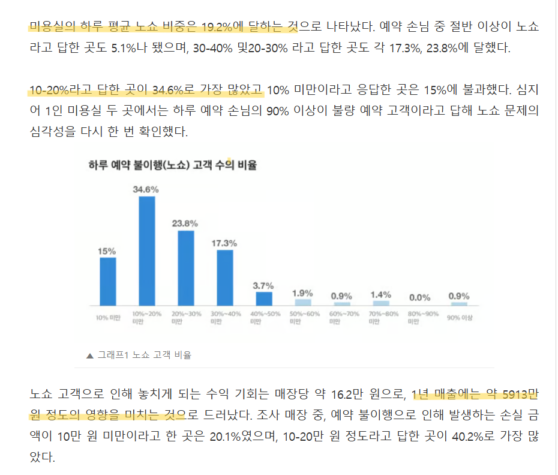
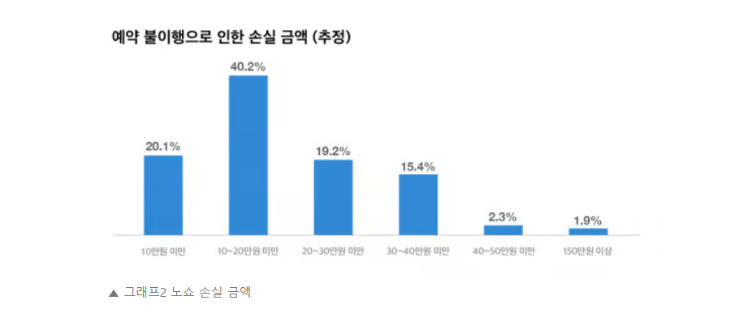
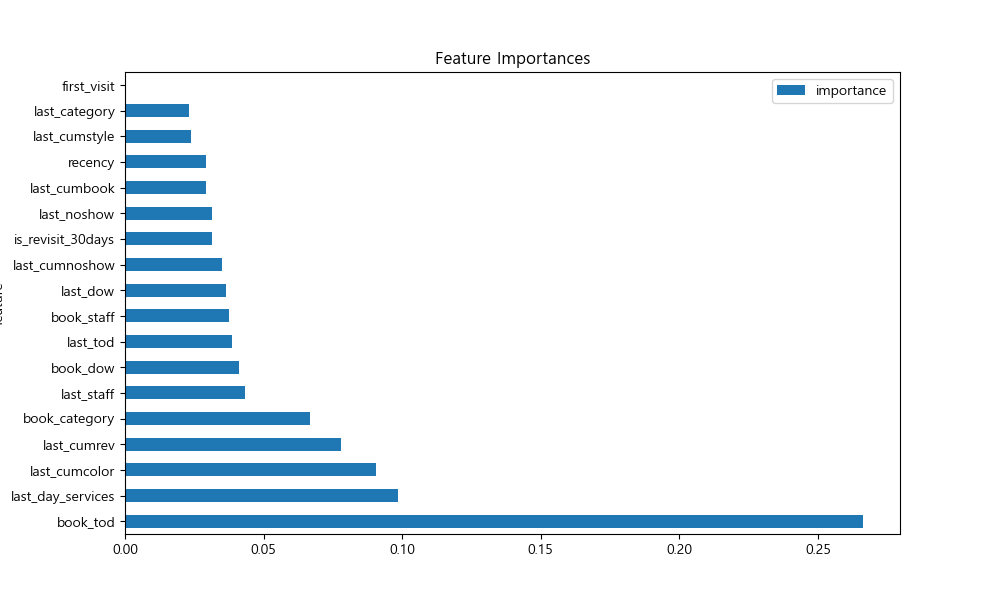

# ✂️ 미용실 고객 노쇼(No-Show) 예측 프로젝트

## 1. 팀명 및 소개

- **팀명**: 세모(임시)
- **팀원**: 고범석, 김동욱, 안수민

---

## 2. 프로젝트 개요

> 고객의 예약 정보를 기반으로 **노쇼 가능성을 예측**하고,
> 노쇼 현상에 대한 경각심을 깨우쳐 주며
> 미용실 운영 효율화를 위한 **사전 대응 방안을 제안**하는 프로젝트
>
> **노쇼**란? 예약했지만 취소한다는 연락 없이 예약 장소에 나타나지 않는 행위

---

## 3. 배경 및 목표

- 대부분의 미용실에서 **고객 노쇼로 인한 손실**이 발생하고 있다.
- 노쇼 가능성이 높은 고객의 특성을 파악하고 예측이 가능하다면, 노쇼 방지를 위한 대책 마련이 가능하다.
- 프로젝트 목표:
  - **노쇼 예측 모델 개발**
  - **영향력 높은 고객 특성 분석**
  - **대응 전략 제안**

---

## 4. 사용 데이터 설명

- **출처**: Kaggle (Hair Salon No-Show Dataset) https://www.kaggle.com/datasets/frederickferguson/hair-salon-no-show-data-set/data
- **샘플 수**: 실제 미용실에서 5개월 간의 예약 1952건
- **컬럼 수**: 20개
- **변수 유형**:
  - 범주형 변수: 요일, 시간대, 서비스 종류, 담당자 등
  - 수치형 변수: 누적 방문 횟수, 누적 결제 금액 등
- **타깃 데이터**: noshow 컬럼 데이터

---

## 5. 기술 스택

- **언어**: Python
- **주요 라이브러리**:
  - 데이터 처리: pandas, numpy
  - 시각화: matplotlib, streamlit
  - 모델링: scikit-learn

---

## 6. 프로젝트 구조

📁 프로젝트 구조 예시 이미지 또는 트리 삽입 예정

---

## 7. EDA (탐색적 분석)

### ✅ 전체 노쇼 비율

- 전체 고객 중 **노쇼(No-Show) 비율은 매우 낮음**
  → **심각한 클래스 불균형**이 존재함
  → 모델이 모두 '음성'이라고 예측해도 **정확도가 높게 나오는 착시** 발생 가능성 있음
  → **SMOTE 오버샘플링**과 같은 보정 기법 필요성 도출

---

### ✅ 요일별 노쇼 경향

_(관련 시각화 이미지 추가하기)_

- **일요일**에 노쇼 비율이 높음
- 전체적으로 요일별로 약간의 편차는 있으나 극단적이지는 않음

---

### ✅ 시간대별 노쇼 경향

- **오후(afternoon)** 에 가장 높음
- 오전(morning)에 비해 아침 시간 노쇼가 두드러짐

---

### ✅ 누적 노쇼 횟수와 실제 노쇼율의 관계

- **누적 노쇼 횟수가 많을수록 실제 노쇼 확률도 증가**
  - 누적 0회 → 노쇼율 매우 낮음
  - 누적 2~3회 → 점진적 증가
  - **누적 4회 이상 고객**의 노쇼율은 평균 대비 **3배 이상**

---

### ✅ 첫 방문 여부와 예측 가능성

- `last_` 계열 컬럼에 결측치가 다수 존재, 이는 **첫 방문 고객**으로 판단됨
  → 모델 학습 큰 영향을 줄 수 있다고 판단했기에 관련된 **파생 변수** 생성 고려
- 첫 방문 고객의 노쇼 경향은 후속 분석 및 모델링에서 주요 고려 대상임

---

## 8. 데이터 전처리

- **결측치 처리**:
  - `last_` 계열 변수: `Unknown`으로 채움 (첫 방문이라는 유의미한 정보)
  - 예약 정보 누락: 최빈값으로 채움 (기록 누락)
- **파생 변수 생성**:
  - `first_visit`: 첫 방문인지 여부
  - `is_revisit_30days`: 한 달 내 재방문인지 여부
- **범주형 변수 인코딩**:
  - Label Encoding: XGBoost, KNN
  - One Hot Encoding: LogisticRegression, SVM, RandomForest
- **수치형 변수 스케일링**: StandardScaler
- **오버 샘플링**:
  - SMOTE: XGBoost, KNN, LogisticRegression, RandomForest
- **데이터 분할**: 8:2 비율, GridSearchCV 내에서 5-Fold(또는 3-Fold) CV 수행

---

## 9. 평가 지표 선정

- 정확도 (Accuracy)
- 정밀도 (Precision)
  - 양성 클래스를 정확하게 예측하기 위함
- **재현율 (Recall)**
  - 소수의 양성 클래스 값을 최대한 예측하기 위함
- F1 Score
- 혼동 행렬
- PR Curve / AP Score
- ROC Curve / AUC Score

---

## 10. 모델 선정

(모델 별 특징, 이유 적기)
| 모델 | 특징 | 선정 이유 |
| ------------------- | ------------------------- | --- |
| Logistic Regression | 기본 분류 성능, 해석 용이 | ㅁㄴㅇ |
| SVM | 마진 기반 분류 | |
| XGBoost | 성능 우수, 트리 기반 |- XGBoost는 부스팅 알고리즘으로 앙상블 기법을 사용하며, 다양한 데이터 유형과 복잡한 패턴에 대해 강력한 성능을 보일 수 있다.  - 클래스 불균형 문제를 다룰 수 있는 가중치 조정과 샘플링 기법을 제공하여 불균형 데이터셋에도 잘 대응할 수 있다. |
| Random Forest | 마진 기반 분류 | |
| KNN | 성능 우수, 트리 기반 | |

---

## 11. 자동화 및 튜닝 전략

- **Pipeline**으로 전처리 + 모델 학습 흐름 구성
- **GridSearchCV**로 튜닝 자동화, 최적의 파라미터 탐색
- 최적의 Threshold 추출
  - Recall이 가장 중요한 평가 지표였기 때문에 Threshold 값을 낮추는 방향으로 조정했다.
  - 너무 작은 Threshold 값은 Recall 값을 1로 고정시키기 때문에 최소 0.3으로 제한을 두었다.

---

## 12. 분석 결과 해석

- 노쇼 고객은 주로 `STYLE` 서비스 / `일요일 점심`에 예약했다.
- XGBoost 모델이 가장 높은 성능을 보였다 (Recall 기준)
- 최적의 XGBoost 모델에서 학습하는 데 가장 중요하게 사용된 특성이 '예약 시간대'임을 알 수 있다.
- 평가 지표에 따라 최적 모델이 달라질 수 있다.

---

## 13. 결과 요약

| 모델                | F1 Score | Recall   | Precision |
| ------------------- | -------- | -------- | --------- |
| Logistic Regression | 0.XX     | 0.XX     | 0.XX      |
| SVM                 | 0.XX     | 0.XX     | 0.XX      |
| XGBoost             | **0.XX** | **0.XX** | **0.XX**  |
| Random Forest       | **0.XX** | **0.XX** | **0.XX**  |
| KNN                 | **0.XX** | **0.XX** | **0.XX**  |

---

## 14. 한 줄 회고

> 고범석: “데이터는 노쇼를 기억하고 있었다.”
> 김동욱: ㅁㄴㅇ
> 안수민: 예측을 넘어 **운영 개선을 이끄는 인사이트 도출**이 가장 큰 수확이었다.

---
