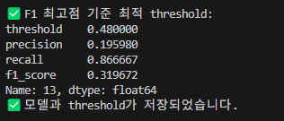
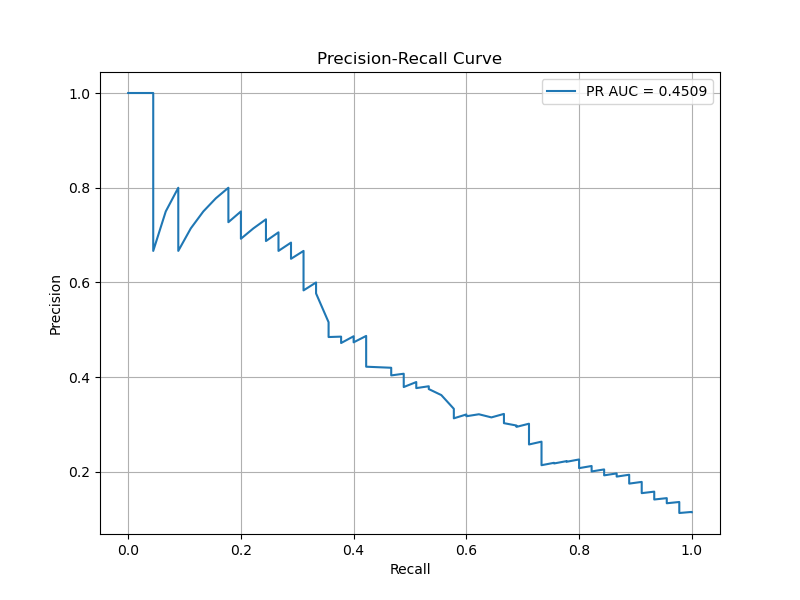
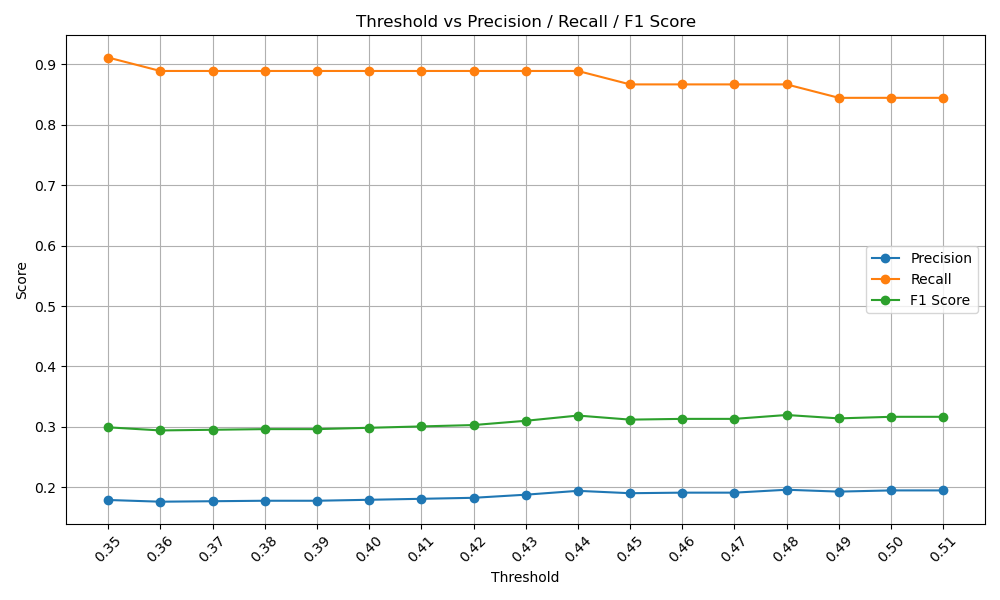
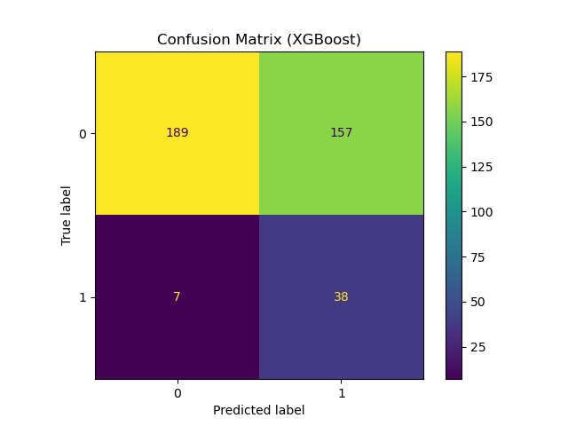

# 모델링 결과서
---
## 1. 평가 지표
본 프로젝트에 사용된 데이터의 불균형으로 인하여 다음 두 가지 평가 지표를 선정했다.

- **재현율 (Recall)**: 실제 노쇼 고객을 얼마나 놓치지 않고 예측했는가?
- **정밀도-재현율 곡선 (PR Curve)**: 정밀도와 재현율 간의 균형 및 trade-off를 시각적으로 파악

#### 재현율 (Recall)
: 실제로 노쇼한 고객 중에서, 예측 모델이 **노쇼라고 맞춘 비율**
- **수식**
\[
\text{Recall} = \frac{\text{TP}}{\text{TP} + \text{FN}}
\]

| 용어 | 의미 |
|------|------|
| TP (True Positive) | 노쇼 고객을 맞게 예측함 |
| FN (False Negative) | 노쇼 고객을 놓침 (정상으로 예측) |

    

#### 정밀도-재현율 (PR Curve)
- **정의**: 여러 threshold에 따라 Precision과 Recall의 관계를 그린 곡선
- **의미**: 데이터가 불균형할 때, 모델의 positive 클래스(노쇼)에 대한 성능을 정밀하게 평가 가능. 곡선 아래 면적으로 높을 수록 성능이 좋다.

    

---

## 2. 모델 튜닝 및 평가

#### 1) 하이퍼파라미터 설정

본 프로젝트에서 XGBoost 분류기를 사용했으며, GridSearchCV를 통해 다음과 같은 하이퍼 파라미터를 조정했다.

- **max_depth**: [3, 5, 7]  
- **learning_rate**: [0.01, 0.05, 0.1, 0.2]  
- **n_estimators**: [100, 200, 300]  
- **subsample**: [0.8, 1.0]  
- **colsample_bytree**: [0.75, 0.8, 1.0]  
- **min_child_weight**: [1, 3, 5]  
- **scale_pos_weight**: (Negative / Positive)

scale_pos_weight의 경우 cost-sensitive 전략으로 Positive class에 추가적인 가중치를 부여함으로써 불균형을 해소하고자 사용했다.
또한 적은 dataset의 문제점을 해결하고자 SMOTE 리샘플링을 훈련 데이터에 적용했다.

최종적으로 선택된 최적의 하이퍼파라미터 조합은 다음과 같다.

- **max_depth**: 7  
- **learning_rate**: 0.05  
- **n_estimators**: 100  
- **subsample**: 0.8  
- **colsample_bytree**: 1.0  
- **min_child_weight**: 5

이러한 설정은 5-fold Stratified K-Fold 교차검증을 기반으로 F1-score 기준 최적화 되었다.

기본적인 평가 지표는 Recall을 선정했지만, 하이퍼파라미터 튜닝 결과 Recall에 비해 Precision과 F-1 score의 차이가 극심하게 발생해 Best_Score 선정 시 F-1 score를 기준으로 선정했다.

#### 2) 모델 성능 시각화 결과  

**정밀도-재현율 곡선 (Precision-Recall Curve)**
- threshold 변화에 따라 모델이 노쇼 고객을 얼마나 정밀하게 예측하는지 보여준다.

**Threshold에 따른 정밀도(Precision), 재현율(Recall), F1 score 변화**
- Threshold를 조정함에 따라 변화하는 정밀도, 재현율, F1 score를 보여준다.

**혼동 행렬 (Confusion Matrix)**
- 최종 선택한 threshold를 기준으로 예측 결과를 실제 값과 비교한 결과이다.

---